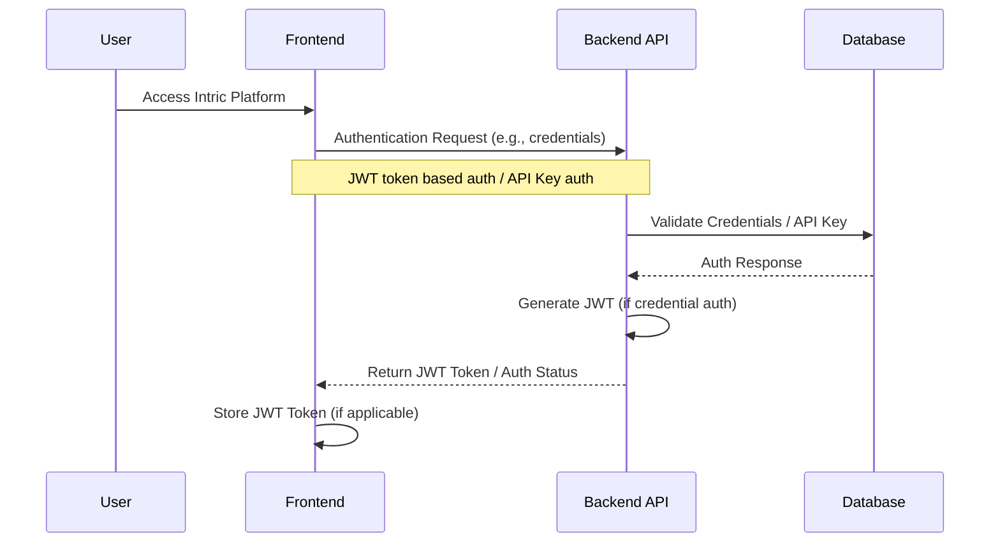
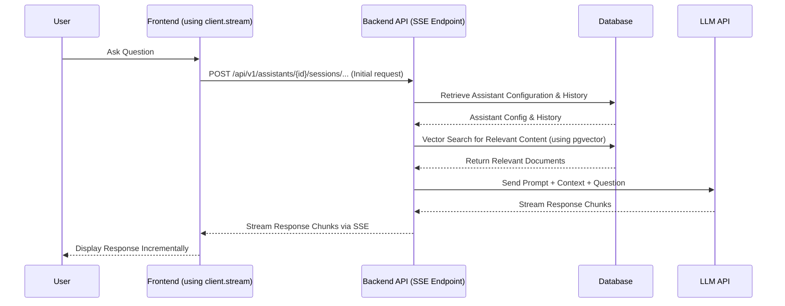
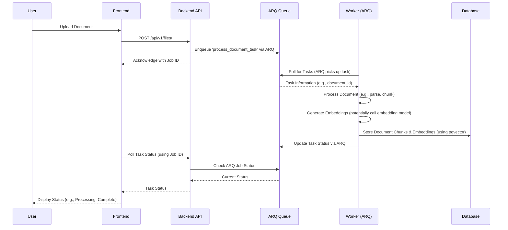

# Intric Architecture

## TLDR

> **Architecture Summary**
> 
> - **Core Components**: Frontend (SvelteKit/Nginx), Backend (FastAPI), Worker (ARQ/Python), Database (PostgreSQL with pgvector), Cache/Queue (Redis)
> - **Data Flow**: REST API for client interaction, SSE for streaming chat, background processing via ARQ task queue
> - **Design Principles**: Domain-driven design, separation of concerns, and clean architecture
> - **Integration**: Vector search for knowledge retrieval, streaming for real-time responses
> - **Scalability**: Independent scaling of frontend, backend, and worker components
> - **Security**: JWT & API Key Authentication, bcrypt password hashing, RBAC via space memberships

This document provides a comprehensive overview of the Intric platform architecture, explaining how different components interact and the design principles behind the system.

## Table of Contents
- [Architecture Overview](#architecture-overview)
- [System Components](#system-components)
- [Data Flow](#data-flow)
- [Key Subsystems](#key-subsystems)
- [Security Architecture](#security-architecture)
- [Scaling Considerations](#scaling-considerations)
- [Design Principles](#design-principles)

## Architecture Overview

Intric employs a microservices architecture that separates concerns into distinct components while maintaining a cohesive system. The platform is designed to be:

- **Modular**: Each component has well-defined responsibilities
- **Scalable**: Components can be scaled independently
- **Resilient**: The system can continue operating despite partial failures
- **Secure**: Multi-layered security approach protects data and communications
- **Extensible**: New capabilities can be added without significant architectural changes

## System Components

The Intric platform consists of these primary components:

```
┌─────────────┐     ┌─────────────┐     ┌─────────────┐
│   Frontend  │────▶│  Backend    │────▶│  Database   │
│ (SvelteKit/ │◀────│  (FastAPI)  │◀────│ (PostgreSQL │
│    Nginx)   │     └─────────────┘     │  +pgvector) │
└─────────────┘          │  ▲           └─────────────┘
                         │  │
                         ▼  │
                    ┌─────────────┐     ┌─────────────┐
                    │   Worker    │────▶│    Redis    │
                    │ (ARQ/Python)│◀────│(Cache/Queue)│
                    └─────────────┘     └─────────────┘
```

### Frontend Service

| Aspect | Details |
|--------|---------|
| **Technology** | SvelteKit application served by Nginx |
| **Responsibility** | Delivers the user interface and manages client-side state |
| **Key Features** | • Responsive UI components<br>• Client-side routing<br>• State management using Svelte stores<br>• Real-time updates via Server-Sent Events (SSE) |

### Backend API

| Aspect | Details |
|--------|---------|
| **Technology** | FastAPI application |
| **Responsibility** | Processes requests, implements business logic, manages authentication |
| **Key Features** | • RESTful API endpoints<br>• JWT & API Key authentication<br>• Request validation with Pydantic<br>• Business logic coordination<br>• LLM integration<br>• SSE endpoint for streaming responses |

### Worker Service

| Aspect | Details |
|--------|---------|
| **Technology** | Python service using ARQ task queue |
| **Responsibility** | Handles long-running background tasks |
| **Key Features** | • Document processing<br>• Website crawling<br>• Vector embedding generation<br>• Asynchronous processing via Redis queue |

#### Worker Implementation

The worker service is built on ARQ, a Redis-based task queue. Task definitions follow this pattern:

```python
# Task definition with ARQ
async def process_document_task(ctx, document_id: str):
    """Process a document and generate embeddings."""
    # Fetch document
    document = await get_document(document_id)

    # Process document
    embeddings = process_document(document)

    # Save embeddings
    await save_embeddings(document_id, embeddings)

    return {"status": "completed", "document_id": document_id}
```

Worker configuration follows the ARQ pattern:

```python
# Example based on Codebase/backend/src/intric/worker/arq.py
class WorkerSettings:
    """ARQ worker settings."""
    redis_settings = RedisSettings(host=REDIS_HOST, port=REDIS_PORT) # Simplified
    functions = [
        process_document_task, # Example task
        crawl_website_task,    # Example task
        # ... other tasks
    ]
    on_startup = startup     # Example startup hook
    on_shutdown = shutdown   # Example shutdown hook
```

### Database

| Aspect | Details |
|--------|---------|
| **Technology** | PostgreSQL with pgvector extension |
| **Responsibility** | Persistent storage for structured data and vector embeddings |
| **Key Features** | • Relational data storage<br>• Vector similarity search<br>• ACID transactions<br>• Data integrity |

### Message Broker / Cache

| Aspect | Details |
|--------|---------|
| **Technology** | Redis |
| **Responsibility** | Task queuing via ARQ, caching, and potentially pub/sub messaging |
| **Key Features** | • Task queue for background jobs (ARQ)<br>• Caching layer<br>• Real-time event publishing (if used)<br>• Temporary data storage |

## Data Flow

### Authentication Flow



### Chat Interaction Flow (Streaming)



### Document Processing Flow (via ARQ Worker)



## Key Subsystems

### Knowledge Base Management

| Purpose | Components |
|---------|------------|
| Manages different sources of knowledge that AI can reference | • Document processor (Worker)<br>• Web crawler (Worker)<br>• Embeddings generator (Worker, possibly external model)<br>• Vector search engine (PostgreSQL with pgvector) |

### Assistant Configuration

| Purpose | Components |
|---------|------------|
| Allows creation and customization of AI assistants | • Prompt templates<br>• Knowledge source management<br>• LLM configuration<br>• Behavior settings |

### Conversation Management

| Purpose | Components |
|---------|------------|
| Handles chat interactions between users and AI assistants | • Session management<br>• Context window management<br>• Response generation<br>• Streaming implementation (SSE) |

### Space Management

| Purpose | Components |
|---------|------------|
| Provides collaborative workspaces for teams | • Access control (RBAC via space memberships)<br>• Resource sharing<br>• Collaboration tools |

## Security Architecture

Intric implements a multi-layered security approach:

### Authentication

- **JWT-based authentication**: For user sessions
- **API key authentication**: For programmatic access
- **Password Hashing**: Uses bcrypt for securely storing user passwords
- **Optional OIDC**: Integration with providers like MobilityGuard

### Authorization

- **Role-Based Access Control (RBAC)**: Implemented primarily through space memberships
- **Resource-level permissions**: Access controlled based on ownership and membership
- **Space-based isolation**: Resources are typically scoped within spaces

### Data Protection

- **Encrypted data in transit**: TLS/SSL configured typically at the ingress level
- **Secure handling of sensitive information**: API keys and secrets managed via environment variables

### API Security

- **Input validation**: Using Pydantic models in FastAPI
- **Rate limiting**: Recommended implementation at the API gateway or backend level
- **CORS**: Configured via middleware in FastAPI
- **Security headers**: Configurable via middleware or web server

## Scaling Considerations

Intric is designed to scale in various ways:

### Horizontal Scaling

| Component | Scaling Approach |
|-----------|------------------|
| **Frontend** | Can be load-balanced across multiple Nginx/SvelteKit instances |
| **Backend** | Multiple FastAPI instances can run behind a load balancer |
| **Worker** | Multiple ARQ worker instances can consume tasks from the Redis queue |

### Database Scaling

- **Connection Pooling**: Managed by SQLAlchemy
- **Read Replicas**: PostgreSQL supports read replicas for high-read scenarios
- **Indexing**: Proper indexing, including HNSW/IVFFlat for pgvector, is crucial for performance

### Caching Strategy

- **Response Caching**: Can be implemented at API gateway or backend level
- **Data Caching**: Redis can cache frequently accessed data (e.g., user sessions, configurations)
- **Distributed Caching**: Redis provides distributed caching capabilities

## Design Principles

Intric follows these key design principles:

### Domain-Driven Design

- **Bounded Contexts**: Separation by domain (e.g., assistants, spaces, files)
- **Entities and Value Objects**: Modeling the domain (e.g., Space, User)
- **Repositories**: Abstracting data access (e.g., SpaceRepository)
- **Domain Services**: Encapsulating business logic (e.g., SpaceService)

### Clean Architecture

- **Separation of Concerns**: Layers for API, application logic, domain, infrastructure
- **Dependency Inversion**: High-level modules don't depend on low-level modules; both depend on abstractions
- **Use Cases**: Encapsulated in application services
- **Framework Independence**: Core domain logic independent of FastAPI/SvelteKit

### API-First Design

- **Well-defined Contracts**: OpenAPI schema generated by FastAPI
- **Consistent Patterns**: RESTful principles applied
- **Comprehensive Documentation**: Auto-generated Swagger/ReDoc UI
- **Versioning**: Typically via API path (`/api/v1/`)

### Observability

- **Structured Logging**: Configurable logging format and level
- **Metrics**: Integration with monitoring tools (e.g., Prometheus, Grafana) is recommended
- **Tracing**: Can be added using libraries like OpenTelemetry
- **Error Tracking**: Integration with services like Sentry is recommended

### Extensibility

- **LLM Providers**: Designed to potentially support multiple providers
- **Service Interfaces**: Using dependency injection allows swapping implementations
- **Configuration-driven**: Behavior controlled via environment variables